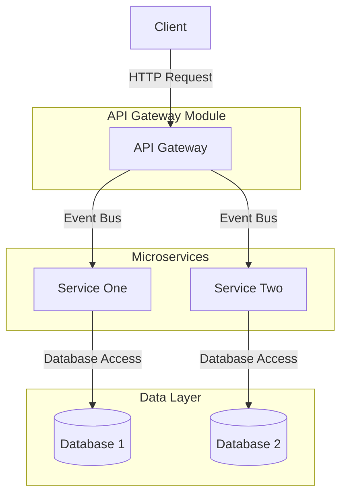
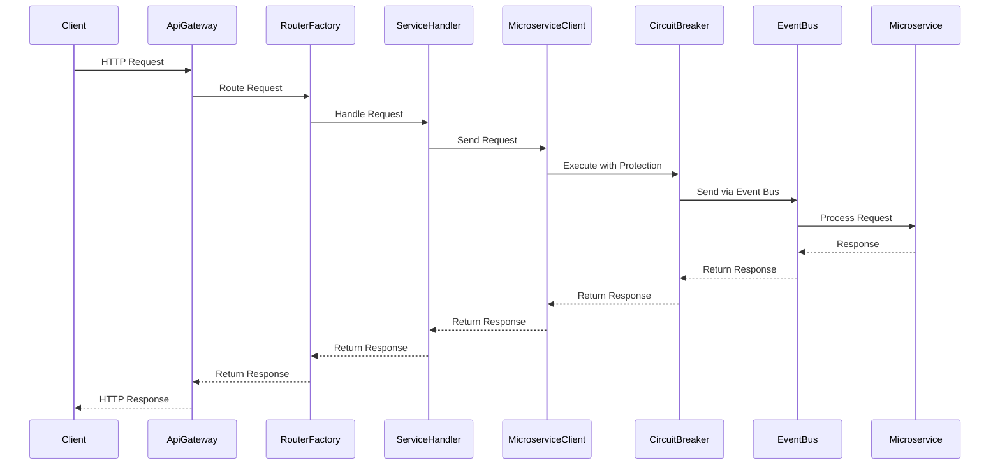
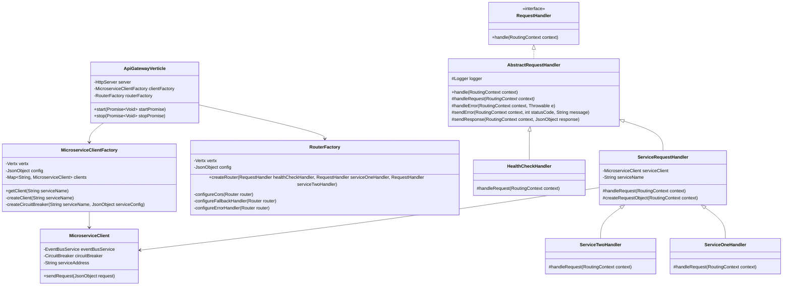
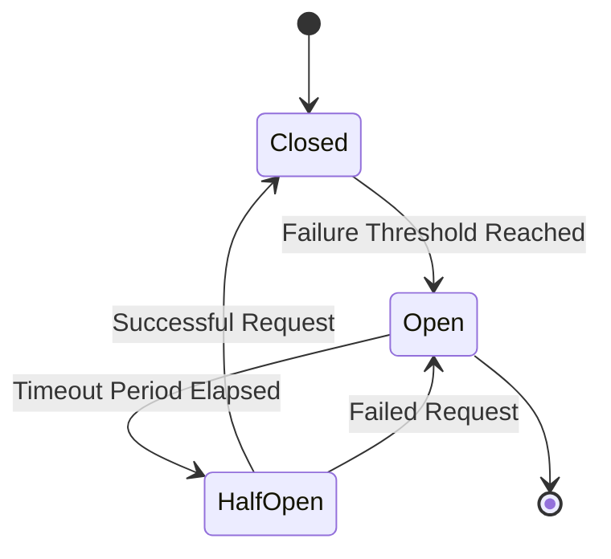

# Architecture Diagrams for Vert.x Reference Project

This document contains various diagrams illustrating the architecture and flow of the Vert.x Reference Project.

## System Architecture



## Request Flow Sequence



## Component Class Diagram



## Circuit Breaker State Diagram



## ASCII Art Diagram (Alternative)

If Mermaid diagrams cannot be rendered, here's a simple ASCII art representation of the system architecture:

```
+----------------+      +----------------+      +----------------+
|                |      |                |      |                |
|     Client     +----->+  API Gateway   +----->+  Microservice  |
|                |      |                |      |                |
+----------------+      +-------+--------+      +----------------+
                               |
                               |
                               v
                        +------+-------+
                        |              |
                        |   Database   |
                        |              |
                        +--------------+
```

## How to View These Diagrams

1. **Mermaid Diagrams**:
    - GitHub automatically renders Mermaid diagrams in markdown files
    - Use the [Mermaid Live Editor](https://mermaid.live/) to view and edit these diagrams
    - Many IDEs have Mermaid plugins (VS Code, IntelliJ, etc.)

2. **ASCII Art**:
    - Viewable in any text editor or markdown viewer
    - No special tools required

## Additional Diagram Types Available

- Entity-Relationship Diagrams (ERD)
- User Flow Diagrams
- Network Topology Diagrams
- Deployment Diagrams
- Gantt Charts for Project Planning